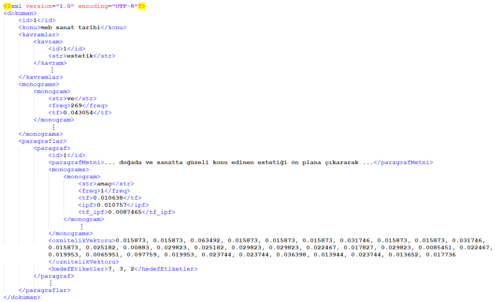

# veriseti-Sanat-Tarihi
DDİ uygulamaları için MEB Sanat Tarihi kitabından  üretilen veriseti (xml)

Bu çalışma, eğitim teknolojilerinde kullanılabilecek Türkçe dokümanlar için çoklu etiketleme yeteneğine sahip metin bölütleme modeli geliştirebilmek için T.C. MEB'e bağlı okullarda okutulan bir Sanat Tarihi kitabından üretilmiş veriseti içermektedir. Bahsi geçen çalışm, değerlendirilmek üzere  <i>Bilişim Teknolojileri Dergisi</i>'ne gönderilmiştir. 
Veriseti xml formatında hazırlanmış olup açık erişimle paylaşıma sunulmuştur. XML dosyasının genel yapısı aşağıda sunulmuştur.

Eğer verisetinden faydalanacak olursanız lütfen atıf veriniz. Atıf bilgileri aşağıda sunulmuştur. 

Kayahan, S., Günel, K. & Nuriyev, U. (2022). "Eğitim İçerikleri için Sezgisel Metin Bölütlemeye Dayalı Çoklu Etiketleme Stratejisi: M.E.B. Sanat Tarihi Kitabı için Bir Durum Çalışması", <i>Bilişim Teknolojileri Dergisi</i>. (submitted) url: https://github.com/kgunel/veriseti-Sanat-Tarihi.
